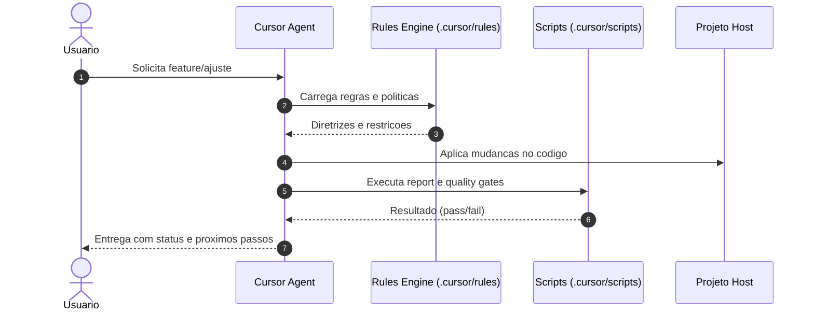
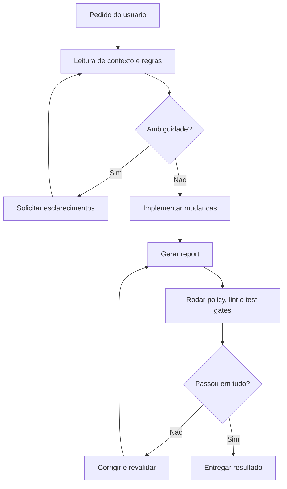
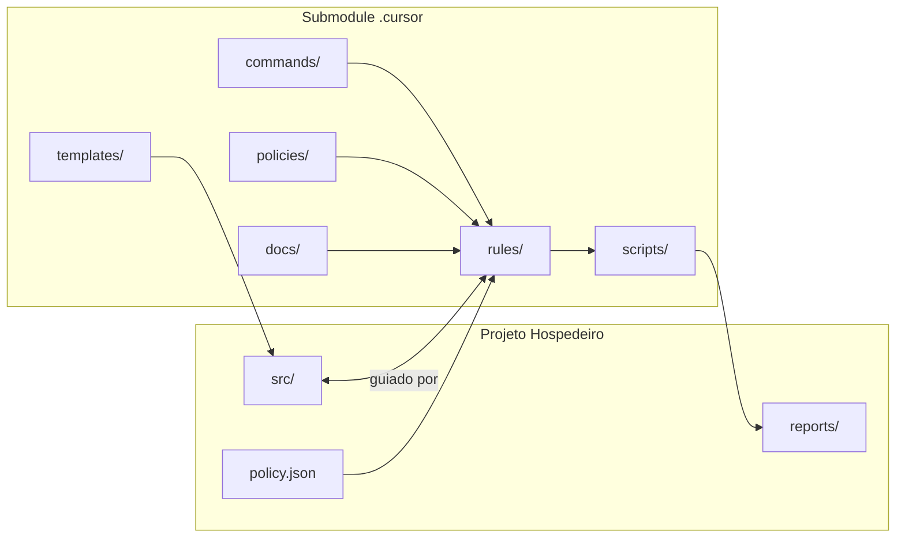

# Enterprise AI Cursor Template (v2)

Este repositorio implementa **governanca de IA enterprise-grade para Cursor** com suporte a multiplos templates e Product Skeleton completo para sistemas SaaS.

## Templates Disponiveis

| Template | Stack | Descricao |
|----------|-------|-----------|
| `tailwind` | React + Vite + Tailwind CSS v4 | Template minimalista com TypeScript |
| `mui` | React + Vite + MUI (Mantis) | Dashboard completo com Material UI |

### Template Tailwind

- React 19+ com TypeScript
- Vite para build
- Tailwind CSS v4 para estilizacao
- Estrutura organizada por features

### Template MUI (Mantis)

- React 19+ (JavaScript)
- Material UI v7
- Dashboard pronto com componentes
- Versoes Free e Pro disponiveis
- Product Skeleton completo

## Modo Submodule (`.cursor/`)

Este repositorio foi desenhado para ser usado como submodule em `.cursor/` dentro do projeto hospedeiro.

- Execute comandos a partir da raiz do projeto hospedeiro.
- Scripts desta plataforma ficam em `.cursor/scripts/`.
- Regras ficam em `.cursor/rules/`.
- Comandos slash ficam em `.cursor/commands/` e aparecem ao digitar `/` no chat do Cursor.

### Adicionar o submodule no caminho correto

Use o comando abaixo para registrar este repositório diretamente em `.cursor`:

```bash
git submodule add https://github.com/supplyahlex/cursor-rules.git .cursor
```

## Caixinha Magica

A "caixinha magica" representa o fluxo de governanca automatizada que transforma pedido -> execucao guiada por regras -> validacao com gates.

### Diagrama de Sequencia



### Diagrama de Fluxo



### Diagrama de Arquitetura



## Quick Start

Siga estes passos para subir rapido com a "caixinha magica":

1. Tenha Node.js LTS instalado (`nvm use --lts` recomendado).
2. Crie um projeto com o script de scaffolding.
3. Entre na pasta do projeto e rode `npm install`.
4. Gere o report do dia.
5. Execute os gates de qualidade.

### Comandos (PowerShell)

```powershell
# 1) Criar projeto (exemplo com MUI Free)
.\.cursor\scripts\create-project.ps1 -AppName meu-dashboard -Template mui -Version free

# 2) Entrar no projeto
cd .\meu-dashboard

# 3) Instalar dependencias
npm install

# 4) Gerar report do dia
node .cursor/scripts/generate-report.js

# 5) Rodar todos os gates
node .cursor/scripts/run-gates.js
```

### Comandos (Bash)

```bash
# 1) Criar projeto (exemplo com Tailwind)
./.cursor/scripts/create-project.sh meu-app

# 2) Entrar no projeto
cd ./meu-app

# 3) Instalar dependencias
npm install

# 4) Gerar report do dia
node .cursor/scripts/generate-report.js

# 5) Rodar todos os gates
node .cursor/scripts/run-gates.js
```

## Criar Novo Projeto

### PowerShell (Windows)

```powershell
# Template Tailwind (padrao)
.\.cursor\scripts\create-project.ps1 -AppName meu-app

# Template MUI Free
.\.cursor\scripts\create-project.ps1 -AppName meu-dashboard -Template mui -Version free

# Template MUI Pro (deps manuais)
.\.cursor\scripts\create-project.ps1 -AppName meu-sistema -Template mui -Version pro
```

### Bash (Linux/Mac)

```bash
# Template Tailwind (padrao)
./.cursor/scripts/create-project.sh meu-app

# Template MUI Free
./.cursor/scripts/create-project.sh meu-dashboard . mui free

# Template MUI Pro
./.cursor/scripts/create-project.sh meu-sistema . mui pro
```

## Estrutura do Projeto Criado

```
meu-projeto/
├── .cursor/
│   └── rules/
│       └── template-rules.mdc    # Regras especificas do template
├── .gitignore
├── docs/                          # Documentacao
├── examples/                      # Telas de exemplo (apenas MUI)
├── src/
│   ├── components/
│   ├── features/                  # Modulos do Product Skeleton
│   │   ├── identity/              # Usuarios, convites, papeis
│   │   ├── sharing/               # Compartilhamento
│   │   ├── billing/               # Faturamento
│   │   ├── payments/              # Stripe
│   │   └── ...
│   ├── templates/
│   │   └── email/                 # Templates de e-mail HTML
│   └── ...
├── scripts/
│   └── remove-examples.js         # Remover exemplos na entrega
├── reports/                       # Reports de qualidade
├── policy.json                    # Politica do template
└── package.json
```

## Product Skeleton

O template MUI inclui um **Product Skeleton** completo com 17 modulos estruturais:

### Modulos Inclusos

| Modulo | Descricao | Componentes Pro |
|--------|-----------|-----------------|
| Identidade e Usuarios | Convites estilo GitLab, papeis, permissoes | DataGrid Pro |
| Compartilhamento | Links com expiracao, e-mail, WhatsApp | - |
| Upload e Arquivos | Drag & drop, progresso, erros | - |
| Chat com IA | Historico, estados | - |
| Notificacoes | Tempo real, historico | - |
| Suporte | Tickets, categorias | DataGrid Pro |
| Ajuda e Onboarding | FAQ, empty states | - |
| Auditoria | Trilhas, filtros, acoes negadas | DataGrid Pro, DateRangePicker |
| Preferencias | Tema, idioma, atalhos | - |
| Seguranca | Sessoes, reautenticacao | - |
| Opt-ins/Opt-outs | Consentimento | - |
| Data Privacy | LGPD/GDPR | DataGrid Pro |
| Termos e Politicas | Aceite, versionamento | - |
| Licenciamento | Matriz planos x features x quotas | - |
| Billing | Demonstrativos, faturas | - |
| Pagamentos | Stripe, cartao, boleto | - |

### Templates de E-mail

O template inclui templates HTML para e-mails transacionais:

- `reset-password.html` - Reset de senha
- `invite-member.html` - Convite de membro
- `share-link.html` - Compartilhamento

## Gerenciamento de Dependencias

O sistema inclui verificacao de dependencias com controle de versao semantica.

### Verificar Dependencias

```bash
# Relatorio de dependencias
node .cursor/scripts/check-deps.js

# Com comandos de atualizacao
node .cursor/scripts/check-deps.js --update

# Saida em JSON
node .cursor/scripts/check-deps.js --json
```

### Politica de Atualizacao

| Tipo | Permitido | Exemplo |
|------|-----------|---------|
| MAJOR | Nao | 19.x.x -> 20.x.x |
| MINOR | Sim | 19.1.x -> 19.2.x |
| PATCH | Sim | 19.1.9 -> 19.1.50 |

### Node.js

Usar sempre a **ultima versao LTS** do Node.js (versoes pares: 22, 24, 26...).

```bash
# Instalar ultima LTS (via nvm)
nvm install --lts
nvm use --lts
```

Consulte `.cursor/rules/62-dependency-updates.mdc` para detalhes.

## Quality Gates

O sistema enforça 4 gates de qualidade:

1. **Policy Gate** - Valida regras de politica do template
2. **Lint Gate** - ESLint
3. **Test Gate** - Vitest
4. **Visual Snapshots** (opcional)

### Executar Gates

```bash
# Executar policy check
node .cursor/scripts/generate-report.js
node .cursor/scripts/policy-check.js

# Executar policy check com scan de imports proibidos
node .cursor/scripts/policy-check.js --scan-imports

# Executar lint gate
node .cursor/scripts/lint-gate.js

# Executar test gate
node .cursor/scripts/test-gate.js

# Validar aderencia minima ao Product Skeleton
node .cursor/scripts/validate-skeleton.js

# Executar todos os gates
node .cursor/scripts/run-gates.js

# Gerar dashboard de metricas de conformidade
node .cursor/scripts/metrics-collector.js
```

## Politicas por Template

### Tailwind (`.cursor/policies/tailwind.json`)

- Tailwind CSS v4 obrigatorio
- CSS customizado proibido
- MUI/Ant Design proibidos
- Estilos inline proibidos

### MUI Free (`.cursor/policies/mui-free.json`)

- MUI obrigatorio
- Componentes MUI Pro proibidos
- Tailwind proibido
- Apenas componentes gratuitos

### MUI Pro (`.cursor/policies/mui-pro.json`)

- MUI obrigatorio
- Componentes Pro permitidos (instalar manualmente)
- Tailwind proibido

## Versoes Free vs Pro (MUI)

| Aspecto | Free | Pro |
|---------|------|-----|
| Componentes basicos MUI | Sim | Sim |
| DataGrid Pro | Nao | Sim |
| Date Pickers Pro | Nao | Sim |
| Charts Pro | Nao | Sim |
| Instalacao | Automatica | Manual |

### Usando versao Pro

1. Crie o projeto com `-Version pro`
2. Execute `npm install`
3. Adicione manualmente as dependencias Pro:
   - [MUI X Pro](https://mui.com/store/)
   - [Mantis Pro](https://codedthemes.com/item/mantis-react/)

## Cursor Rules

O projeto inclui regras completas para o agente:

| Regra | Descricao |
|-------|-----------|
| `00-global.mdc` | Regras globais e templates disponiveis |
| `60-scaffolding.mdc` | Scaffolding automatico pelo agente |
| `61-quality-gates.mdc` | Quality gates automaticos |
| `62-dependency-updates.mdc` | Atualizacao segura de dependencias |
| `70-design-system-tailwind.mdc` | Design System Tailwind |
| `71-design-system-mui.mdc` | Design System MUI (Free/Pro) |
| `72-product-skeleton.mdc` | Modulos estruturais obrigatorios |

## Integracao Stripe

O template MUI inclui estrutura para integracao com Stripe:

### Metodos de Pagamento

- Cartao de Credito
- Boleto Bancario

### Webhooks Suportados

- `payment_intent.succeeded`
- `payment_intent.payment_failed`
- `invoice.paid`
- `customer.subscription.updated`

## Workflow Tipico

1. Criar projeto com o script de scaffolding
2. Desenvolver seguindo as regras do template
3. Atualizar `reports/YYYY-MM-DD.report.json` com `node .cursor/scripts/generate-report.js`
4. Executar gates antes de commitar
5. Corrigir violacoes se necessario
6. Remover exemplos (MUI) antes da entrega

## Comandos Slash (`/`)

Comandos slash sao prompts reutilizaveis do Cursor:

- Arquivos em `.cursor/commands/*.md`
- Para usar: abra o chat, digite `/` e selecione o comando
- Exemplo: `/generate-report`

Os comandos slash disparam instrucoes para o agente, que entao executa os comandos reais de terminal.

## Estrutura do Repositorio

```
host-project/
├── .cursor/                # Este submodule
│   ├── rules/              # Regras globais do Cursor
│   │   ├── 00-global.mdc
│   │   ├── 60-scaffolding.mdc
│   │   ├── 61-quality-gates.mdc
│   │   ├── 70-design-system-tailwind.mdc
│   │   ├── 71-design-system-mui.mdc
│   │   └── 72-product-skeleton.mdc
│   ├── commands/           # Comandos slash
│   ├── docs/               # Documentacao da plataforma
│   ├── memory/             # Templates de memoria
│   ├── policies/           # Politicas por template
│   │   ├── tailwind.json
│   │   ├── mui-free.json
│   │   └── mui-pro.json
│   ├── reports/            # Schema e templates de report
│   ├── scripts/            # Scripts de automacao
│   │   ├── create-project.ps1
│   │   ├── create-project.sh
│   │   ├── check-deps.js
│   │   ├── generate-report.js
│   │   ├── policy-check.js
│   │   ├── lint-gate.js
│   │   ├── test-gate.js
│   │   ├── validate-skeleton.js
│   │   ├── metrics-collector.js
│   │   └── run-gates.js
│   └── templates/          # Templates de projeto
│       ├── react-vite-tailwind/
│       └── react-vite-mui/
└── reports/                # Reports do projeto hospedeiro
```

## Links Uteis

- [Documentacao do Cursor](docs/cursor-setup.md)
- [Guia zero ao sucesso (usuario e desenvolvedor)](docs/guia-zero-ao-sucesso.md)
- [Setup para Windows/macOS em modo submodule](docs/submodule-setup-windows-macos.md)
- [Stack Requirements](docs/stack-requirements.md)
- [Workflow](docs/workflow.md)
- [Product Skeleton](docs/product-skeleton.md)
